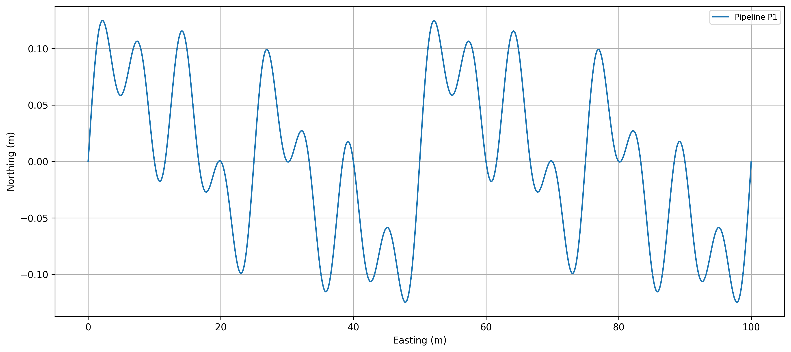
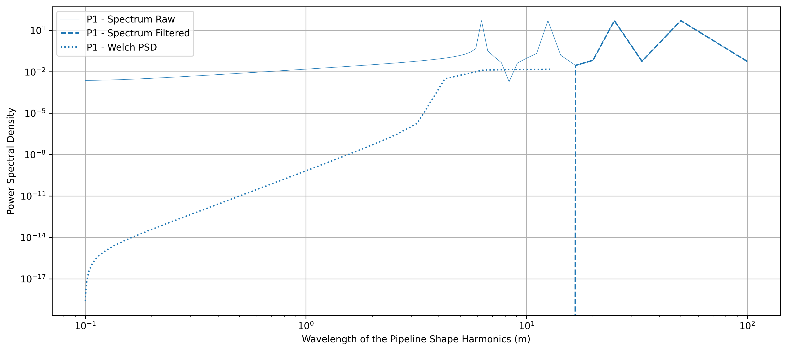

###############
Getting Started
###############

.. raw:: html

   

***********************************
About RefPy: A Foundational Library
***********************************

RefPy is designed as a foundational library for pipeline and riser design. A foundational library provides core building blocks and reusable components that can be used directly in your own scripts, applications, or larger frameworks. It is not a standalone application, but rather a toolkit that enables rapid development and robust analysis by providing well-tested, well-documented, and efficient functions and classes.

What is a Foundational Library?
-------------------------------

A foundational library is a collection of essential tools and abstractions that serve as the basis for more complex workflows and applications. It is intended to be imported and used as a dependency in your own Python code, rather than run as a program by itself. Foundational libraries are typically:

- Modular and extensible
- Well-documented and tested
- Focused on core functionality, not user interfaces
- Designed for integration into other projects

Current Modules in RefPy
------------------------

RefPy currently includes the following modules:

- ``linepipe_tools.py``: Provides the ``Pipe`` class for geometric and material property calculations of pipeline sections, including diameters, areas, stiffness, and moments of inertia.
- ``dnv_tools.py``: Contains classes and functions for DNV pipeline code calculations, including general utilities and limit state checks (``DNVGeneral``, ``DNVLimitStates``).
- ``lateral_buckling_tools.py``: Implements the ``LBDistributions`` class for lateral buckling reliability analysis and friction factor distribution fitting.
- ``pipe_soil_interaction_tools.py``: Provides the ``PSI`` class for pipe-soil interaction calculations, including resistance and displacement models.
- ``oos_tools.py``: Contains the ``OOSAnonymisation`` and ``OOSSmoother`` classes for processing, anonymising, and smoothing Out-Of-Straightness (OOS) survey data.
- ``abaqus_tools.py``: Includes the ``AbaqusPy`` class for generating sensitivity files and automating input preparation for Abaqus finite element analysis.

Each module is designed to be imported and used independently or in combination, depending on your analysis needs. For more details, see the API Reference section of the documentation.

.. raw:: html

   

*************************
Testing the RefPy Package
*************************

The repository includes a file called ``test_refpy.py`` that provides automated testing for the main classes and methods in RefPy. This script is designed to help you verify that your installation and code changes are working as expected.

How to Run the Tests
--------------------

To run all tests, simply execute the following command in your terminal from the root of the repository:

.. code-block:: bash

   $ python test_refpy.py

What Does It Test?
------------------

The ``test_refpy.py`` script will automatically run doctests for the following classes:

- ``Pipe``
- ``DNVGeneral``
- ``DNVLimitStates``
- ``LBDistributions``
- ``PSI``

Each method in these classes that includes a docstring example will be tested. The script will print a summary of the number of tests attempted, passed, and failed.

This makes it easy to check that all core functionality is working as intended after installation or modification.

.. raw:: html

   

***********************
Running Example Scripts
***********************

The repository also includes three files called ``example_1_refpy.py``, ``example_2_refpy.py`` and ``example_3_refpy.py`` that demonstrates how to use the main features of RefPy with real input data. This script is a practical starting point for new users.

How to Run the Example
----------------------

To run the example scripts, execute the following commands in your terminal from the root of the repository:

.. code-block:: bash

   $ python example_1_refpy.py
   $ python example_2a_refpy.py
   $ python example_2b_refpy.py
   $ python example_3_refpy.py

What Does It Demonstrate?
-------------------------

**The ``example_1_refpy.py`` script contains examples to demonstrate:**

Pipe, DNV, PSI, LBDistributions Example: Demonstrates how to create and use the ``Pipe``, ``DNVLimitStates``, ``PSI``, ``LBDistributions`` classes for pipeline property calculations.

.. figure:: _static/example_1.png
   :alt: Example 1
   :width: 400
   :align: center

   Example 1: Pipe, DNV, PSI and LB Calculations

**The ``example_2a_refpy.py`` script contains examples to show:**

OOS Example: Shows how to use the ``OOSAnonymisation``, ``OOSDespiker``, ``OOSCurvature``, ``FFTSmoother``, ``GaussianSmoother`` classes for group-wise signal processing and survey data anonymisation.

   Example 2a, Plot 1: Survey Route Overview. This plot is useful to visualise the out-of-straightness per survey section. It splits the survey route into individual sections and displays the out-of-straightness for each section, distinguishing between nominally straight and curved sections. It also shows locations where survey points have been despiked.

   Example 2a, Plot 2: Anonymised Smoothing. These plots intend to visualise how the anonymisation and smoothing processes affect the survey data at the pipeline group level.

   Example 2a, Plot 3: Spectral Analysis - Coordinates. This plot visualises the wavelength distribution of the survey data, highlighting the noise associated with the survey.

   Example 2a, Plot 4: Curvatures Smoothing. This plot is useful to visualise the smoothing effects on the curvature.

   Example 2a, Plot 5: Spectral Analysis - Curvatures. This plot visualises the radius of curvature distribution of the survey data, highlighting the noise associated with the survey curvatures.

**The ``example_2b_refpy.py`` script contains examples to show:**

OOS Example - Syntetic Signal: Shows how to use the ``OOSDespiker``, ``OOSCurvature``, ``FFTSmoother``, ``GaussianSmoother`` classes and also shows that works as intended for a syntetic signal.

   Example 2b, Plot 1: Syntetic signal data integrated by four harmonics of 6.25m, 12.5m, 25m and 50m wavelength.

   Example 2b, Plot 2: Syntetic signal data integrated by four harmonics of 6.25m, 12.5m, 25m and 50m wavelength. The signal integrated by these four harmonics is compared with a new signals in which the 6.25m and 12.5m wavelength harmonics are filtered/smoothed out using the FFTSmoother

   Example 2b, Plot 3: Spectral Analysis - Coordinates. This plot visualises the wavelength distribution of the syntetic signal, highlighting the four harmonic peaks.

   Example 2b, Plot 4: Curvatures Smoothing. In this plot, the original and filtered signal curvatures are compared.

.. figure:: _static/example_2b_plot5.png
   :alt: Example 2b Plot 5
   :width: 600
   :align: center

   Example 2b, Plot 5: Spectral Analysis - Curvatures. This plot visualises the radius of curvature distribution of the syntetic signal, highlighting the noise associated with the syntetic signal curvatures.

**The ``example_3_refpy.py`` script contains examples to illustrate:**

AbaqusPy Example: Illustrates how to use the ``AbaqusPy`` class for generating Abaqus input files with sensitivity analysis.

   Example 3: General Overview of a Master Abaqus Input File